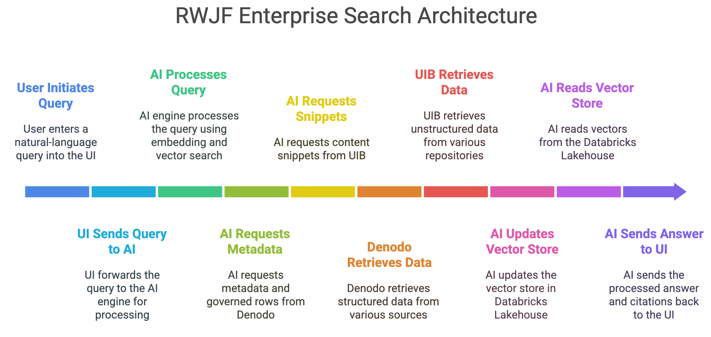

# AI-Driven Enterprise Search Blueprint – Robert Wood Johnson Foundation

**Version 1.2 – Narrative Edition**  
**Date:** 27 June 2025  
**Author:** Harindha Fernando – Enterprise Architect, NCINGA

---

## 1. Executive Summary – Why Modernise Now?

RWJF’s legacy enterprise search relies on Raytion connectors, a technology that has now been placed on an end‑of‑life path following Raytion’s recent acquisition. This creates an imminent risk of search outage across Oracle, Adobe AEM and SharePoint unless a replacement architecture is adopted. At the same time, RWJF is transitioning grants management onto Salesforce Nonprofit Cloud and intends to leverage Salesforce Data Cloud as its primary data layer while maintaining a substantial Microsoft 365 and Azure footprint.

The proposed architecture therefore serves two urgent purposes:
1. Preserve continuity of enterprise search as Raytion support winds down.
2. Modernise the experience to deliver AI‑driven, semantically rich answers that span Salesforce, Microsoft and on‑premises content — all under a single, governed interface.

NCINGA’s blueprint replaces brittle connectors with a dual‑layer integration model: Denodo virtualises structured sources while UIB, our secure API gateway, brokers unstructured content. Sentiyo provides the conversational AI layer, and Databricks supplies lakehouse analytics and vector storage for Retrieval‑Augmented Generation (RAG). This design aligns with RWJF’s hybrid‑cloud strategy, enabling phased adoption without disruptive data migrations.

In discussions with RWJF leadership, two design paths — Salesforce‑centric and Azure‑centric — were explored. The blueprint supports either path, ensuring continuous value regardless of future ecosystem emphasis.

---

## 2. Business Drivers & Success Criteria – Why This Matters to RWJF

- **Mission alignment:** Faster insight loops directly advance RWJF’s public‑health mission.
- **Operational efficiency:** Target a 70 % reduction in time‑to‑information by unifying search.
- **Risk & compliance:** A single policy plane ensures GDPR‑grade protection of donor and staff data.
- **Cost optimisation:** ROI will be quantified jointly; section 9 outlines the data we will gather.

---

## 3. Architectural Principles – How We Keep the Solution Durable

1. **Governance‑First** – access checked before data leaves its source.  
2. **Virtualise, Don’t Migrate** – move data only when analytics demands it.  
3. **Composable over Monolithic** – each layer replaceable without lock‑in.  
4. **Observable by Design** – logs and metrics exported to SOC tooling.  
5. **User‑Centric UX** – one conversational interface; plumbing is invisible to users.

---

## 4. Reference Architecture – What We Are Building and Why

The architecture is deliberately layered. Users interact solely with Sentiyo’s conversational interface. Sentiyo interprets intent, retrieves governed structured data via Denodo and secure document snippets via UIB, then composes answers backed by Databricks vector search. This separation maximises agility and simplifies policy enforcement.

**Figure 4.1 – Technology Architecture**  

---

## 5. End-to-End User Journey – Experience in Motion

1. Authenticate – Single Sign-On via Azure AD  
2. Ask – Sentiyo captures natural-language queries  
3. Interpret – AI expands the query, generating filter hints  
4. Govern – Denodo and UIB enforce role-based policies and PII masking  
5. Retrieve – Structured rows and redacted snippets stream back  
6. Compose – Sentiyo returns an answer with citations  
7. Act – Users drill into Power BI dashboards or share insights in Teams  

**Figure 5.1 – User Journey Diagram**  

---

## 6. Security & Compliance – Trust by Architecture, Not Afterthought

- PII classification via Azure Purview propagates automatically to Denodo and UIB  
- TLS 1.3 end-to-end; zero-trust network segmentation between micro-services  
- Immutable audit logs retained for seven years, meeting IRS and GDPR obligations  

**Figure 6.1 – Security & Compliance Layers**  

---

## 7. Deployment & Onboarding – How New Systems Join the Platform

1. Profile & classify – data stewards tag sensitivity and ownership  
2. Govern – RBAC and masking rules created once in Denodo or UIB  
3. Connect – API or SQL view established, policies smoke-tested  
4. Index – Sentiyo embeds metadata and snippets  
5. Validate – Pilot queries confirm relevance and redaction before go-live  

**Figure 7.1 – Onboarding Flow**  

---

## 8. Operational Excellence – Keeping the Lights On, Securely

CI/CD pipelines deploy all components via blue/green containers. Logs, traces and metrics stream into Azure Monitor; Sentinel automations raise alerts. Quarterly chaos drills validate fail-closed security behaviour.

---

## 9. Cost Optimisation & ROI – Structured Next Step

Rather than applying speculative ROI figures, we propose forming a joint RWJF–NCINGA working group to collect:
- Legacy platform spend (Oracle, Raytion, bespoke connectors)  
- Productivity baselines (time-to-information, ticket volume)  
- Licence and support contract data  
- User-satisfaction metrics  
- Storage redundancy and replication overhead  

Within four weeks the group will deliver a baseline TCO, a defensible board-level ROI projection and an insights report to guide future budgeting.

The true value of the transformation lies not only in cost savings but in enabling faster insights, fewer escalations and stronger compliance.

---

## 10. Road-map & Phased Delivery – Risk-Managed Transformation

- Phase 0 – Mobilise (2 weeks): charter, RACI, landing zone  
- Phase 1 – Foundation (6 weeks): Denodo platform, UIB hardening, SSO integration  
- Phase 2 – Pilot (8 weeks): Salesforce + SharePoint search for pilot users  
- Phase 3 – Expansion (12 weeks): onboard AEM, Drupal, Workday; retire Oracle PIMS  
- Phase 4 – Optimise (ongoing): ML-driven relevance tuning and dashboard rollout  

---
