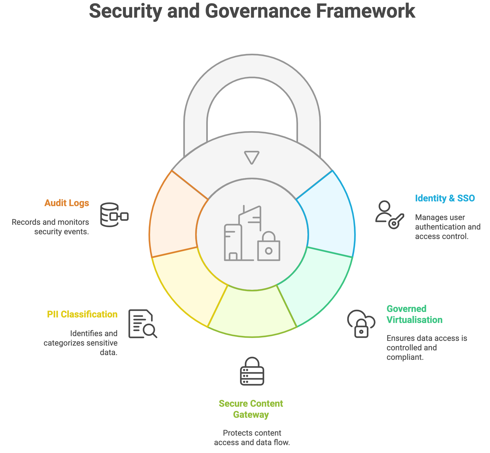

# AI-Driven Enterprise Search Blueprint – Robert Wood Johnson Foundation

**Version 1.2 – Narrative Edition**  
**Date:** 27 June 2025  
**Author:** Harindha Fernando – Enterprise Architect, NCINGA

---

## 1. Executive Summary – Why Modernise Now?

RWJF’s legacy enterprise search relies on Raytion connectors, a technology that has now been placed on an end‑of‑life path following Raytion’s recent acquisition. This creates an imminent risk of search outage across Oracle, Adobe AEM and SharePoint unless a replacement architecture is adopted. At the same time, RWJF is transitioning grants management onto Salesforce Nonprofit Cloud and intends to leverage Salesforce Data Cloud as its primary data layer while maintaining a substantial Microsoft 365 and Azure footprint.

The proposed architecture therefore serves two urgent purposes:
1. Preserve continuity of enterprise search as Raytion support winds down.
2. Modernise the experience to deliver AI‑driven, semantically rich answers that span Salesforce, Microsoft and on‑premises content — all under a single, governed interface.

NCINGA’s blueprint replaces brittle connectors with a dual‑layer integration model: Denodo virtualises structured sources while UIB, our secure API gateway, brokers unstructured content. Sentiyo provides the conversational AI layer, and Databricks supplies lakehouse analytics and vector storage for Retrieval‑Augmented Generation (RAG). This design aligns with RWJF’s hybrid‑cloud strategy, enabling phased adoption without disruptive data migrations.

In discussions with RWJF leadership, two design paths — Salesforce‑centric and Azure‑centric — were explored. The blueprint supports either path, ensuring continuous value regardless of future ecosystem emphasis.

---

## 2. Business Drivers & Success Criteria – Why This Matters to RWJF

- **Mission alignment:** Faster insight loops directly advance RWJF’s public‑health mission.
- **Operational efficiency:** Target a 70 % reduction in time‑to‑information by unifying search.
- **Risk & compliance:** A single policy plane ensures GDPR‑grade protection of donor and staff data.
- **Cost optimisation:** ROI will be quantified jointly; section 9 outlines the data we will gather.

---

## 3. Architectural Principles – How We Keep the Solution Durable

1. **Governance‑First** – access checked before data leaves its source.  
2. **Virtualise, Don’t Migrate** – move data only when analytics demands it.  
3. **Composable over Monolithic** – each layer replaceable without lock‑in.  
4. **Observable by Design** – logs and metrics exported to SOC tooling.  
5. **User‑Centric UX** – one conversational interface; plumbing is invisible to users.

---

## 4. Reference Architecture – What We Are Building and Why

The architecture is deliberately layered. Users interact solely with Sentiyo’s conversational interface. Sentiyo interprets intent, retrieves governed structured data via Denodo and secure document snippets via UIB, then composes answers backed by Databricks vector search. This separation maximises agility and simplifies policy enforcement.

**Figure 4.1 – Technology Architecture**  

---

## 5. User Journey Flow

The user journey begins with a natural language query — for example, “Show me all grants awarded to education programs in New Jersey in the last 5 years.” This query, whether entered via the Sentiyo interface or federated via intranet/SharePoint, is authenticated through Azure AD and routed to the intelligent orchestration layer.

### Step-by-Step Flow:
1. **Authentication** – The user signs in using corporate SSO (Azure AD) with policy-enforced multifactor authentication.
2. **Intent Interpretation** – Sentiyo's agentic AI interprets the query and determines the semantic domain (structured or unstructured).
3. **Access Authorization** – Role-based access control, data masking, and policy checks are applied based on user context.
4. **Data Retrieval** – Depending on the source type:
   - Structured queries are routed through Denodo for virtualized, policy-enforced access.
   - Unstructured queries route through UIB for snippet-level extraction from SharePoint, AEM, Drupal, or rwjf.org.
5. **Answer Synthesis** – Sentiyo generates an explainable answer using Retrieval-Augmented Generation (RAG), combining structured values with referenced source snippets.
6. **Result Delivery** – The response is returned through Sentiyo’s interface with citations, or redirected to Power BI for data exploration.

The following subsections expand on the intelligent orchestration and architectural decomposition behind this flow.

---

## 5.1 Agentic AI Execution Model – Modular Intelligence in Action

At the heart of the Sentiyo search layer is a modular **Agentic AI Execution Model**. Instead of monolithic AI models, the platform delegates responsibilities across autonomous, cooperating agents. This provides auditability, explainability, and the ability to evolve components independently.

### Key Agents and Responsibilities:

- **Intent Agent**  
  Parses the natural language query, identifies semantic scope, entities, and query type (e.g., fact lookup vs. document retrieval). It formulates an intermediate search plan.

- **Access Agent**  
  Consults the user’s JWT token, associated RBAC policies, and organizational masking rules. It validates permissions before triggering any downstream execution.

- **Retrieval Agent**  
  Orchestrates data access:
  - For structured data: issues SQL or Denodo view calls.
  - For unstructured: issues secure requests via UIB to repositories like SharePoint, AEM, or public websites.

- **Response Agent**  
  Synthesizes a complete, human-readable response using vector embeddings and Retrieval-Augmented Generation (RAG), referencing both structured values and content snippets.

### Agentic Benefits:
- **Separation of concerns**: Each agent is self-contained and focused on one task.
- **Observability**: Logs and metrics are granular, improving traceability and debugging.
- **Upgradability**: Each agent can evolve independently (e.g., plugging in GPT-5.5 instead of GPT-4-turbo).
- **Compliance**: Easier enforcement of data governance rules via the Access Agent.

**Figure 5.1 – Agentic AI Search Flow**  

---

## 5.2 Functional Layers – Responsibilities Over Vendors

This architecture separates concerns cleanly across logical layers, ensuring each function is modular, testable, and replaceable. Below is a vendor-agnostic breakdown of the system’s responsibilities:

- **Input Layer**  
  Captures user query (natural language) via Sentiyo’s UI. No preprocessing or assumptions occur here.

- **Intent Understanding Layer**  
  Interprets query intent, determines if it targets structured or unstructured data, and formulates a retrieval plan. Performed by the Sentiyo AI Engine’s "Intent Agent".

- **Policy & Access Control Layer**  
  Evaluates user’s JWT context, access rights, and PII masking requirements before allowing any query execution. Enforced jointly by Denodo (structured) and UIB (unstructured).

- **Retrieval Layer – Structured**  
  Executes virtual SQL queries via Denodo Views, providing governed access to live transactional data without migration.

- **Retrieval Layer – Unstructured**  
  Requests masked snippets from SharePoint, AEM, Drupal and other repositories through UIB’s secure API gateway.

- **Answer Composition Layer**  
  Combines retrieved data using Retrieval-Augmented Generation (RAG), with vector support via Databricks, to produce grounded, explainable responses.

- **Presentation Layer**  
  Sentiyo returns the final response to the user, with inline citations, and optionally enables hand-off to Power BI for deep analytics.

**Figure 5.2 – Functional Layers (Vendor-Agnostic)**  

---

## 6. Security & Compliance – Trust by Architecture, Not Afterthought

- PII classification via Azure Purview propagates automatically to Denodo and UIB  
- TLS 1.3 end-to-end; zero-trust network segmentation between micro-services  
- Immutable audit logs retained for seven years, meeting IRS and GDPR obligations  

**Figure 6.1 – Security & Compliance Layers**  

---

## 7. Deployment & Onboarding – How New Systems Join the Platform

1. Profile & classify – data stewards tag sensitivity and ownership  
2. Govern – RBAC and masking rules created once in Denodo or UIB  
3. Connect – API or SQL view established, policies smoke-tested  
4. Index – Sentiyo embeds metadata and snippets  
5. Validate – Pilot queries confirm relevance and redaction before go-live  

**Figure 7.1 – Onboarding Flow**  

---

## 8. Operational Excellence – Keeping the Lights On, Securely

CI/CD pipelines deploy all components via blue/green containers. Logs, traces and metrics stream into Azure Monitor; Sentinel automations raise alerts. Quarterly chaos drills validate fail-closed security behaviour.

---

## 9. Cost Optimisation & ROI – Structured Next Step

Rather than applying speculative ROI figures, we propose forming a joint RWJF–NCINGA working group to collect:
- Legacy platform spend (Oracle, Raytion, bespoke connectors)  
- Productivity baselines (time-to-information, ticket volume)  
- Licence and support contract data  
- User-satisfaction metrics  
- Storage redundancy and replication overhead  

Within four weeks the group will deliver a baseline TCO, a defensible board-level ROI projection and an insights report to guide future budgeting.

The true value of the transformation lies not only in cost savings but in enabling faster insights, fewer escalations and stronger compliance.

---

## 10. Road-map & Phased Delivery – Risk-Managed Transformation

- Phase 0 – Mobilise (2 weeks): charter, RACI, landing zone  
- Phase 1 – Foundation (6 weeks): Denodo platform, UIB hardening, SSO integration  
- Phase 2 – Pilot (8 weeks): Salesforce + SharePoint search for pilot users  
- Phase 3 – Expansion (12 weeks): onboard AEM, Drupal, Workday; retire Oracle PIMS  
- Phase 4 – Optimise (ongoing): ML-driven relevance tuning and dashboard rollout  

---
